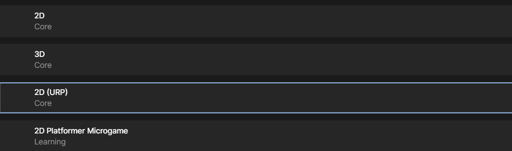

# 6th

# unity
## how difference 2d and 2d urp



https://kurokumasoft.com/2022/01/06/builtin-vs-urp-vs-hdrp/

according this site, it is better to use urp if you don't have any specific reason.
but it better to think the feature of the mode.
- nomal one is good for old version assets.
- urp is fast to descrive the game view
- hdrp is very beautful of the game view but it is slow.

There are two ways of install urp 
1. chose urp when you make project
2. install urp from package manager


# markdown
## how to show code
https://docs.github.com/ja/get-started/writing-on-github/working-with-advanced-formatting/creating-and-highlighting-code-blocks

like this one

````C
```C
printf("Hello World");
```
````

when you type shif + @, you can type ` (back quoat)

take care not '(shift + 7)

## how to show image

liek thie one

```md

```


